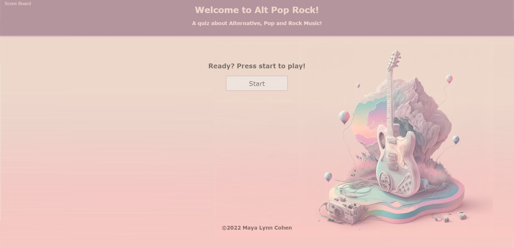
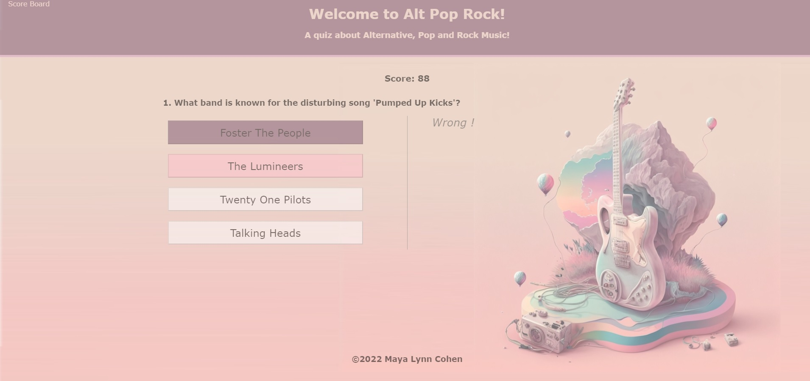
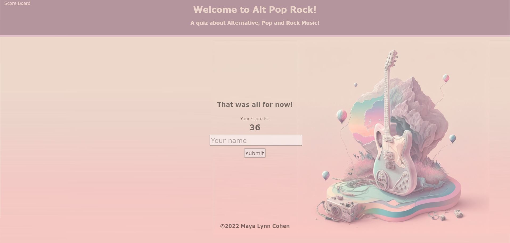
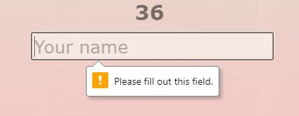
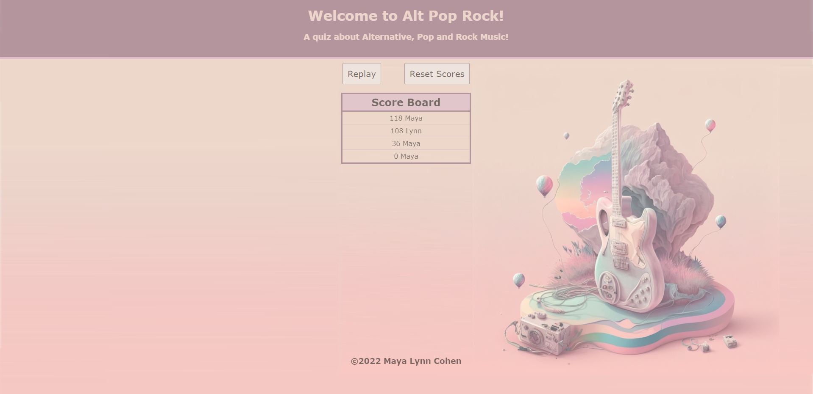
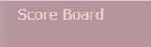

# Alt-pop-rock

## Description

This is a fun little quiz about some of my favorite music. It is meant to be entertaining. this tested all my html, css and JavaScript skill and helped me learn much more about LocalStorage and how to make a dynamic page without using multiple html files.

## Installation

N/A

## Usage

To visit my website go to the following URL: https://mayalynn96.github.io/alt-pop-rock/

First screen to apear is the Start section. By clicking on the start button the game will start.

Once the game starts each question will have 4 possible answers. If the user answers correctly, the button pressed will light up in purple and it will let the user know they are correct to the right side of the buttons. If the user is wrong, the button they clicked will turn pink, the correct answer will light up in purple and the user will be informed that they are wrong to the right of the buttons. Additionaly a score counter will start counting down and remove 10 second every time a wrong answer is selected.

Once the game is over the time left becomes the score and the user is asked to enter name. this field is required and won't validate unless data is entered.

Once a name is entered it will go to the score board screen where the user can see all the previous scores played on that browser in order of highest to lowest. There is a replay button on top of the score board that reloads the page and brings the user back to the start screen. There is a second button next to it that let's the user reset all of the scores.

The user can also click on the Score Board link in the top left corner to be brought directly to the score board screen from any part of the game except from the score board itself.

## Credits

N/A

## License
N/A